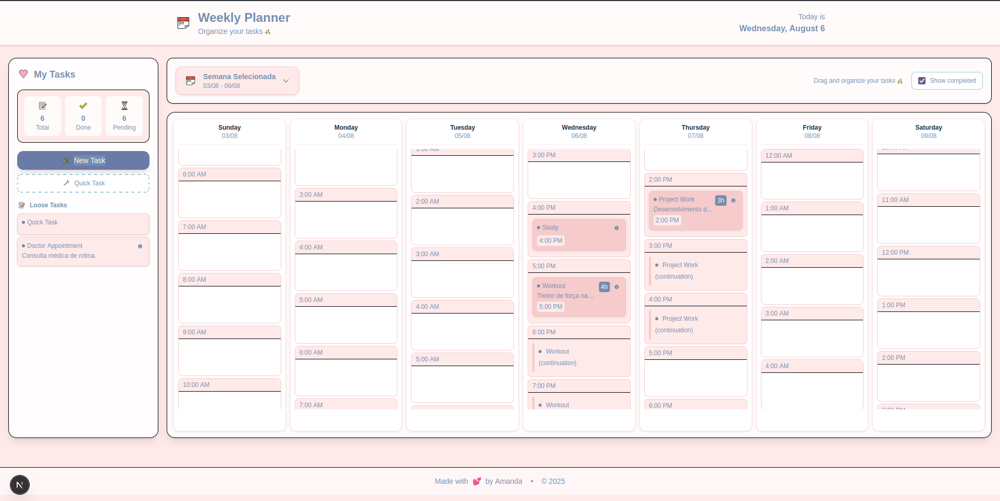

# 📅 Weekly Planner

A modern, interactive weekly task planner built with Next.js and React. Organize your tasks efficiently with drag-and-drop functionality, visual scheduling, and comprehensive task management with a beautiful kawaii-inspired design.



## ✨ Features

- **📝 Task Management**: Create, edit, delete, and mark tasks as complete
- **🖱️ Drag & Drop**: Move tasks between days and time slots effortlessly
- **⏰ Smart Scheduling**: Automatic conflict detection and time validation
- **📊 Statistics**: Real-time task counters and progress tracking
- **🎨 Custom SVG Icons**: Beautiful hand-crafted icons for enhanced visual experience
- **🌍 International**: Complete English interface with intuitive design
- **🎨 Cohesive Design**: Custom color palette (#FFEAEA, #F5CBCB, #9ECAD6, #748DAE)
- **📱 Responsive Design**: Works seamlessly on desktop and mobile devices
- **⚡ Enhanced UX**: Double-click anywhere on task cards to view details

## 🚀 Getting Started

### Prerequisites
- Node.js 18+ 
- npm or yarn

### Installation

1. Clone the repository:
```bash
git clone https://github.com/Amandabezsiv/weekly-planner.git
cd weekly-planner
```

2. Install dependencies:
```bash
npm install
```

3. Run the development server:
```bash
npm run dev
```

4. Open [http://localhost:3000](http://localhost:3000) in your browser.

## 🎯 How to Use

### Creating Tasks
- Click **"New Task"** to open the creation form
- Fill in title, description, day, time, and duration
- Or use **"Quick Task"** for quick drag-and-drop creation

### Managing Tasks
- **View Details**: Double-click anywhere on a task card
- **Edit**: Click "Edit" in the task details modal
- **Complete**: Mark tasks as done with the "Complete" button
- **Delete**: Remove tasks with confirmation prompt

### Organizing Tasks
- **Drag & Drop**: Move tasks between days and time slots
- **Filter View**: Toggle completed tasks visibility with "Show completed" checkbox
- **Statistics**: Monitor progress with Total, Done, and Pending counters
- **Week Navigation**: Navigate between weeks with intuitive controls

## 🛠️ Built With

- **[Next.js](https://nextjs.org/)** - React framework for production
- **[React](https://reactjs.org/)** - UI library with hooks and modern patterns
- **[@dnd-kit](https://dndkit.com/)** - Drag and drop functionality
- **[Tailwind CSS](https://tailwindcss.com/)** - Utility-first CSS framework
- **Custom SVG Icons** - Hand-crafted icons for enhanced visual experience

## 📂 Project Structure

```
src/
├── app/
│   ├── page.js          # Main application component
│   ├── layout.js        # App layout
│   └── globals.css      # Global styles
├── components/
│   ├── DayColumn.jsx    # Calendar day view
│   ├── TaskCard.jsx     # Individual task display
│   ├── TaskModal.jsx    # Task creation form
│   ├── TaskDetailModal.jsx  # Task details view
│   ├── EditTaskModal.jsx    # Task editing form
│   ├── WeekSelector.jsx     # Week navigation component
│   ├── ClientOnly.jsx      # Hydration helper component
│   └── icons/
│       ├── CalendarIcon.jsx # Custom calendar SVG icon
│       ├── StarIcon.jsx     # Custom star SVG icon
│       ├── NoteIcon.jsx     # Custom note SVG icon
│       ├── CheckIcon.jsx    # Custom check SVG icon
│       ├── HourIcon.jsx     # Custom hour SVG icon
│       ├── PinkHeartIcon.jsx # Custom heart SVG icon
│       ├── PencilIcon.jsx   # Custom pencil SVG icon
│       └── FastIcon.jsx     # Custom fast SVG icon
└── utils/
    └── data.js          # Initial tasks and utilities
```

## 🎨 Design Features

### Custom Color Palette
- **Background**: `#FFEAEA` - Soft pink background
- **Borders**: `#F5CBCB` - Light pink borders
- **Accents**: `#9ECAD6` - Soft blue accents
- **Text**: `#748DAE` - Blue-gray text

### Custom SVG Icons
- 📄 **Note Icon**: For tasks and documentation
- ✅ **Check Icon**: For completed tasks
- 🕒 **Hour Icon**: For time-related elements
- 💖 **Pink Heart Icon**: For favorites and love
- ⭐ **Star Icon**: For new tasks and highlights
- ✏️ **Pencil Icon**: For editing functionality
- ⚡ **Fast Icon**: For quick actions

### Task States
- � **Active Tasks**: Scheduled tasks in the calendar
- 🟢 **Completed Tasks**: Tasks marked as done
- 🟡 **Temporary Tasks**: Drag-to-schedule tasks
- ⚪ **Loose Tasks**: Unscheduled tasks in sidebar

## 📱 Available Scripts

```bash
# Development
npm run dev          # Start development server
npm run build        # Build for production
npm run start        # Start production server

# Code Quality
npm run lint         # Run ESLint
npm run format       # Format code with Prettier
```

## 🚀 Deployment

Deploy easily on [Vercel](https://vercel.com/):

```bash
# Install Vercel CLI
npm i -g vercel

# Deploy
vercel
```

Or deploy to any platform that supports Next.js applications.

## 🤝 Contributing

1. Fork the repository
2. Create a feature branch: `git checkout -b feature/amazing-feature`
3. Commit your changes: `git commit -m 'feat: add amazing feature'`
4. Push to the branch: `git push origin feature/amazing-feature`
5. Open a Pull Request

### Development Guidelines
- Use the established color palette for consistency
- Follow the kawaii design aesthetic
- Ensure all text is in English
- Test for hydration errors when adding new components
- Use custom SVG icons instead of emojis when possible

## 📄 License

This project is open source and available under the [MIT License](LICENSE).

## 👩‍💻 Author

**Amanda** - [@Amandabezsiv](https://github.com/Amandabezsiv)

---

⭐ Star this repository if you found it helpful!
